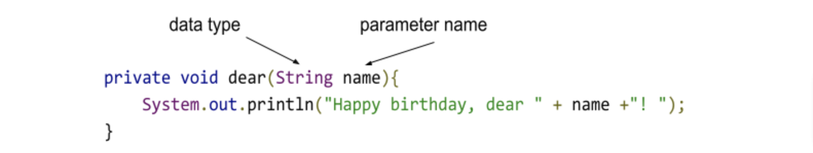
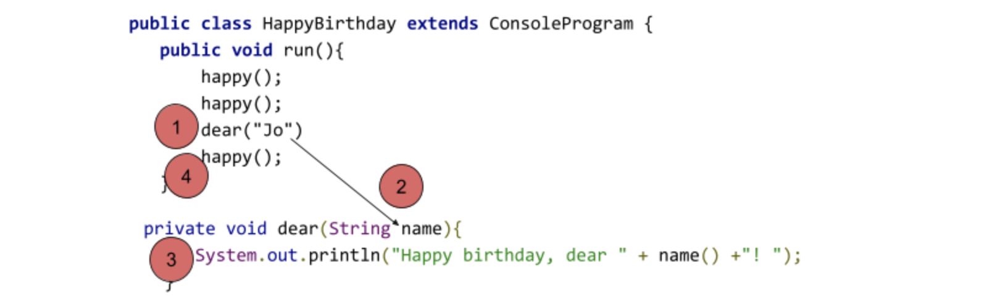

# 3.2.1 Methods with Parameters

Recall our HappyBirthdayFred program from the previous lesson:


```
package unit3;
import codehs.ConsoleProgram;

/**
* A program that greets happy birthday to fred
*/
public class HappyBirthdayFred extends ConsoleProgram {
   public void run(){
       happy();
       happy();
       System.out.println("Happy birthday, dear Fred!");
       happy();
   }

   private void happy(){
       System.out.println("Happy birthday to you!");
   }
}
```


This program is great … if your name is Fred!   How can we change the program to make it more generic to sing to different people.

Let's create a method with one parameter.


```
private void dear(String name){
    System.out.println("Happy birthday, dear " + name +"! ");
}
```





# About Parameters


* The parameter as it is defined as part of a method definition is called a **"formal parameter"**
* We've only discussed input in terms of user input, parameters are a type of input for a method (subprogram) that comes from the calling program (code that uses the method)
* Parameters are variables that we use within the method.  We don't know what the value will be (but we do know it's type), but we can use the variable assuming that it has a value when it is run.


# Calling a Method with a Parameter

We can call our dear() method in our program.


```
happy();
happy();
dear("Jo");
happy();
```


The value that is supplied to a method call is called the **"actual parameter"**


```
Here is the code again within a complete program

package unit3;
import codehs.ConsoleProgram;

/**
* A program that greets happy birthday to fred
*/
public class HappyBirthday extends ConsoleProgram {
   public void run(){

       String celebrant = readLine("Who's birthday is it?");
       happy();
       happy();
       dear(celebrant);       
       happy();
   }

   private void happy(){
       System.out.println("Happy birthday to you!");
   }

   private void dear(String name){
      System.out.println("Happy birthday, dear " + name +"! ");
   }

}
```


# The 4 Step Process of a Method Call

When a method is called, a four-step process is initiated:


1. The calling program suspends execution at the point of call.
2. The formal parameters of the method get assigned the values supplied by the actual parameters in the call.
3. The body of the method is executed.
4. Control returns to the point just after where the method is called



Describe the control flow of the program when **<code>dear("Jo")</code></strong> is called (use the 4 step process)


<table>
  <tr>
   <td>1
   </td>
   <td>dear("Jo") is called, run() method suspends execution
   </td>
  </tr>
  <tr>
   <td>2
   </td>
   <td>name is assigned the value "Jo"
   </td>
  </tr>
  <tr>
   <td>3
   </td>
   <td>body of dear() is executed
   </td>
  </tr>
  <tr>
   <td>4
   </td>
   <td>control returns back to the the run() method to run the next line after dear("Jo")
   </td>
  </tr>
</table>


# Methods with Multiple Parameters

Define a method area() that prints the area of parameters length and width.


```
private void area(int length, int width){
    System.out.println(length*width);  
}
```

#### Example of calling area()
```
area(10,20)
```

Outputs
200

